# FOLIO LMS - Bilingual System Documentation
# نظام إدارة المكتبة فوليو - دليل ثنائي اللغة

**Version / الإصدار:** 1.0.0
**Date / التاريخ:** November 2, 2025
**Languages / اللغات:** English & العربية

---

## Table of Contents / جدول المحتويات

### English
1. [System Overview](#system-overview)
2. [Login Page](#1-login-page)
3. [Dashboard](#2-dashboard)
4. [User Management](#3-user-management)
5. [Roles & Permissions](#4-roles--permissions)
6. [Patron Groups](#5-patron-groups)
7. [Fees & Fines](#6-fees--fines)
8. [Inventory Management](#7-inventory-management)
9. [Book Catalog](#8-book-catalog)
10. [Circulation](#9-circulation)

### Arabic / العربية
1. [نظرة عامة على النظام](#نظرة-عامة-على-النظام)
2. [صفحة تسجيل الدخول](#1-صفحة-تسجيل-الدخول)
3. [لوحة التحكم](#2-لوحة-التحكم)
4. [إدارة المستخدمين](#3-إدارة-المستخدمين)
5. [الأدوار والصلاحيات](#4-الأدوار-والصلاحيات)
6. [مجموعات المستفيدين](#5-مجموعات-المستفيدين)
7. [الرسوم والغرامات](#6-الرسوم-والغرامات)
8. [إدارة المخزون](#7-إدارة-المخزون)
9. [فهرس الكتب](#8-فهرس-الكتب)
10. [الإعارة](#9-الإعارة)

---

## System Overview

FOLIO LMS (Library Management System) is a comprehensive, bilingual library management solution designed to handle all aspects of library operations including:

- User and patron management with role-based access control (RBAC)
- Inventory management (instances, holdings, items)
- Circulation operations (check-out, check-in, renewals, requests)
- Acquisitions management (purchase orders, invoices, vendors, funds)
- Fee and fine tracking with automated calculations
- Course reserves management
- Comprehensive reporting and audit logging
- Real-time WebSocket notifications
- Full bilingual support (English/Arabic) with RTL layout

### Key Features
- **Multi-tenant Architecture**: Support for multiple library branches
- **Role-Based Access Control**: 7 system roles with granular permissions
- **Bilingual Interface**: Seamless switching between English and Arabic
- **RTL Support**: Proper right-to-left layout for Arabic interface
- **Modern Tech Stack**: React 18 + TypeScript + FastAPI + PostgreSQL
- **Real-time Updates**: WebSocket integration for live notifications

---

## نظرة عامة على النظام

نظام فوليو لإدارة المكتبات هو حل شامل ثنائي اللغة مصمم للتعامل مع جميع جوانب عمليات المكتبة بما في ذلك:

- إدارة المستخدمين والمستفيدين مع التحكم في الوصول القائم على الأدوار
- إدارة المخزون (السجلات، المقتنيات، العناصر)
- عمليات الإعارة (الإعارة، الإرجاع، التجديد، الطلبات)
- إدارة المشتريات (أوامر الشراء، الفواتير، الموردين، الأموال)
- تتبع الرسوم والغرامات مع الحسابات التلقائية
- إدارة احتياطيات الدورات
- تقارير شاملة وسجلات التدقيق
- إشعارات فورية عبر WebSocket
- دعم كامل ثنائي اللغة (الإنجليزية/العربية) مع تخطيط من اليمين إلى اليسار

### الميزات الرئيسية
- **بنية متعددة المستأجرين**: دعم فروع مكتبات متعددة
- **التحكم في الوصول القائم على الأدوار**: 7 أدوار نظام مع صلاحيات دقيقة
- **واجهة ثنائية اللغة**: التبديل السلس بين الإنجليزية والعربية
- **دعم RTL**: تخطيط صحيح من اليمين إلى اليسار للواجهة العربية
- **مجموعة تقنية حديثة**: React 18 + TypeScript + FastAPI + PostgreSQL
- **تحديثات فورية**: تكامل WebSocket للإشعارات المباشرة

---

# English Documentation

## 1. Login Page

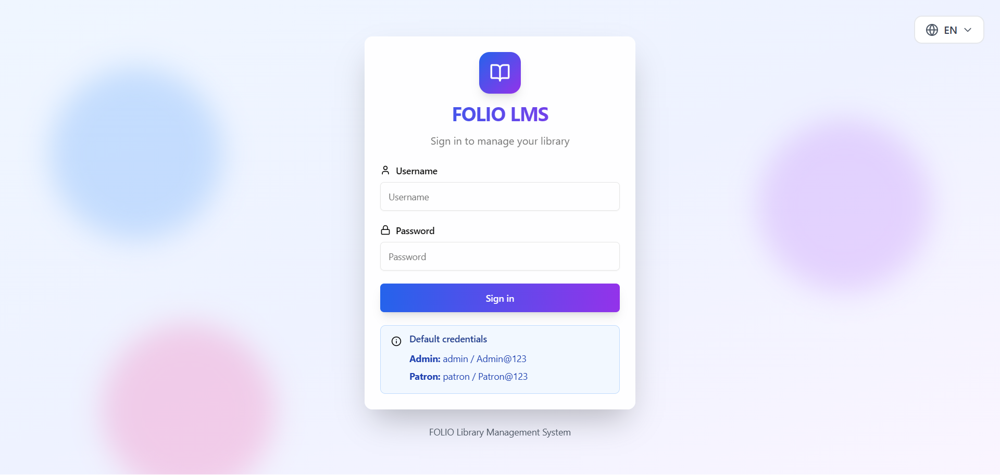

### Description
The login page provides secure authentication for library staff and patrons. It features a clean, modern design with a blue-purple gradient background.

### Features
- Username and password authentication
- Default credentials displayed for testing
- Language switcher in top-right corner (EN/AR)
- Responsive design for all device sizes
- Password security validation

### Default Credentials
- **Administrator**: admin / Admin@123
- **Patron**: patron / Patron@123

### Technical Details
- JWT-based authentication with access and refresh tokens
- Password policy: minimum 8 characters with uppercase, lowercase, number, and special character
- Session management with automatic token refresh
- Protection against brute force attacks

---

## 2. Dashboard

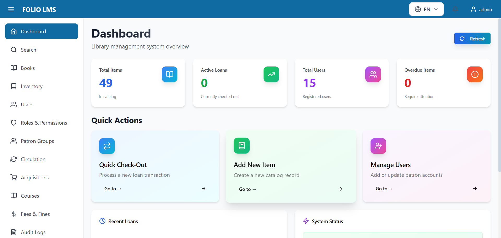

### Description
The main dashboard provides an at-a-glance overview of library operations with key statistics and quick action cards.

### Key Metrics Displayed
- **Total Items**: 49 items in the catalog
- **Active Loans**: 0 currently checked out
- **Total Users**: 15 registered users
- **Overdue Items**: 0 requiring attention

### Quick Actions
1. **Quick Check-Out**: Process new loan transactions
2. **Add New Item**: Create new catalog records
3. **Manage Users**: Add or update patron accounts

### Additional Information
- **Recent Loans**: Shows latest circulation activity
- **System Status**: Displays API, database, and cache service status
- **Refresh Button**: Updates all statistics in real-time

### Navigation
The left sidebar provides access to all major modules:
- Dashboard, Search, Books, Inventory
- Users, Roles, Patron Groups
- Circulation, Acquisitions, Courses
- Fees & Fines, Audit Logs

---

## 3. User Management

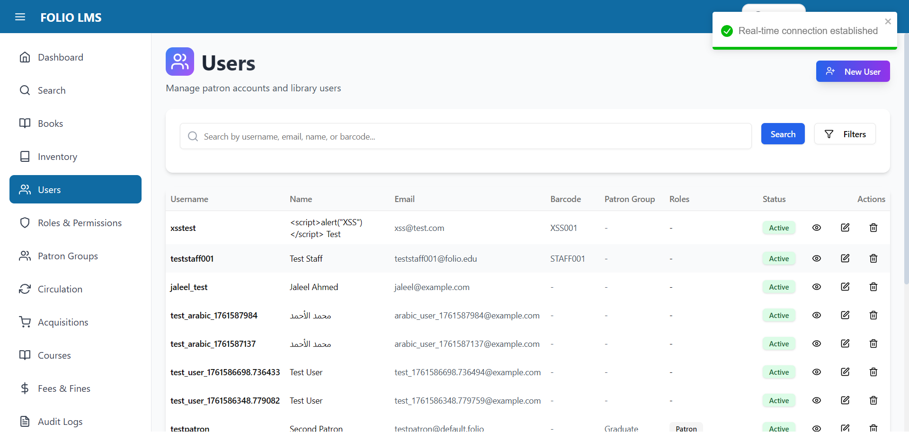

### Description
Comprehensive user management interface for managing library staff and patron accounts.

### Features
- **User List**: Paginated table showing all users with key information
- **Search Functionality**: Search by username, email, name, or barcode
- **Filters**: Filter by user type, status, and patron group
- **New User Button**: Create new user accounts with role assignment

### User Table Columns
- Username
- Full Name
- Email Address
- Barcode
- Patron Group
- Assigned Roles
- Status (Active/Inactive)
- Actions (View, Edit, Delete)

### User Types
- **Staff**: Library employees with administrative access
- **Patron**: Regular library members with limited permissions

### Displayed Users (Sample)
- 15 total users including administrators, librarians, catalogers, circulation staff, and patrons
- Mix of English and Arabic names demonstrating bilingual support
- Various user types and patron groups

### Actions Available
- **View**: Display detailed user information
- **Edit**: Modify user details and permissions
- **Delete**: Remove user account (with confirmations)

---

## 4. Roles & Permissions

### Description
Role-based access control (RBAC) management for defining user permissions and system access levels.

### System Roles
1. **Administrator** (70 permissions)
   - Full system access - can perform all operations
   - System role (cannot be deleted)

2. **Administrator** (23 permissions)
   - Full system access
   - System role

3. **Cataloger** (4 permissions)
   - Catalog management only
   - System role

4. **Circulation Desk** (6 permissions)
   - Circulation operations only
   - System role

5. **Circulation Desk Staff** (14 permissions)
   - Checkout, checkin, renewals
   - System role

6. **Librarian** (16 permissions)
   - Library staff with full operational access
   - System role

7. **Patron** (1 permission)
   - Regular library patron
   - System role

### Features
- **View Permissions**: See all permissions assigned to each role
- **Permission Count**: Quick overview of permission levels
- **System Role Indicator**: Identifies protected system roles
- **Add New Role**: Create custom roles with specific permissions

### Permission Management
- Granular permission system following `resource.action` pattern
- Examples: `inventory.create`, `circulation.checkout`, `users.update`
- Permissions grouped by resource (Inventory, Circulation, Users, etc.)

---

## 5. Patron Groups

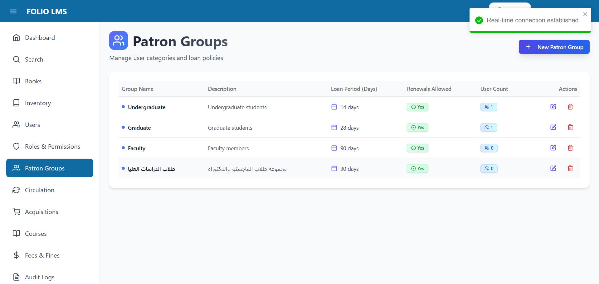

### Description
Manage patron categories with different loan policies and privileges.

### Patron Groups Displayed
1. **Undergraduate** (1 user)
   - Loan period: 14 days
   - Renewals allowed: Yes
   - Description: Undergraduate students

2. **Graduate** (1 user)
   - Loan period: 28 days
   - Renewals allowed: Yes
   - Description: Graduate students

3. **Faculty** (0 users)
   - Loan period: 90 days
   - Renewals allowed: Yes
   - Description: Faculty members

4. **طلاب الدراسات العليا** (0 users)
   - Loan period: 30 days
   - Renewals allowed: Yes
   - Description: Graduate students (Arabic)

### Features
- **New Group Button**: Create new patron groups
- **Edit**: Modify group settings and loan policies
- **Delete**: Remove groups (only if no users assigned)
- **User Count**: Shows number of patrons in each group

### Loan Policy Settings
- Configurable loan period in days
- Renewal permissions (allow/disallow)
- Description for internal reference

---

## 6. Fees & Fines

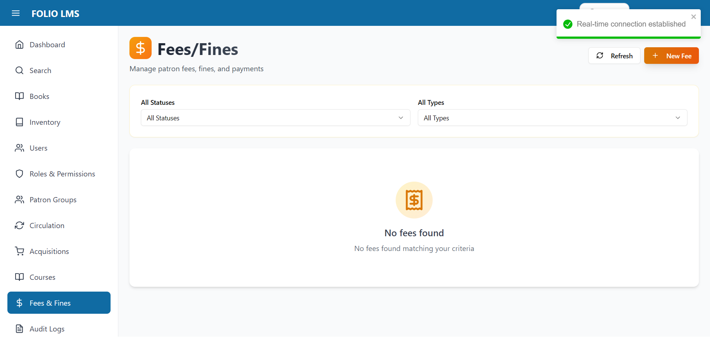

### Description
Comprehensive fee and fine management system for tracking patron charges and payments.

### Features
- **Status Filter**: Filter by fee status (all, open, paid, waived)
- **Type Filter**: Filter by fee type (overdue, lost, damaged, etc.)
- **New Fee Button**: Manually create fees for patrons
- **Refresh**: Update fee list with latest data

### Empty State
Currently showing no fees in the system. The page displays:
- Icon indicating empty state
- Message: "No fees found"
- Subtitle: "No fees found matching your criteria"

### Fee Management Capabilities
- Create manual fees
- Track overdue fines (automated calculation)
- Record payments
- Waive fees with reason
- View payment history
- Generate fee reports

### Fee Statuses
- **Open**: Unpaid fees requiring action
- **Paid**: Fees that have been paid
- **Waived**: Fees waived by staff
- **Transferred**: Fees moved to collection agency

---

## 7. Inventory Management

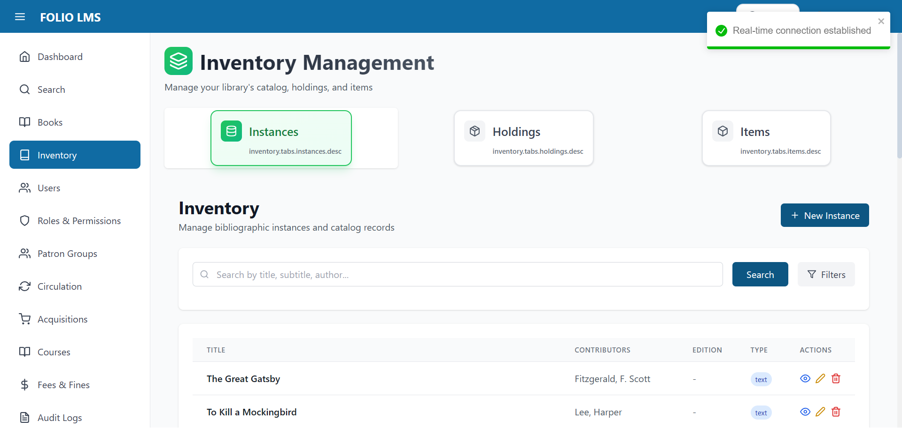

### Description
Three-tier inventory management system for organizing library materials.

### Hierarchy Levels
1. **Instances** (Selected)
   - Bibliographic records
   - Title, author, publication information
   - Currently showing 49 total records

2. **Holdings**
   - Location and call number information
   - Links instances to physical locations

3. **Items**
   - Individual physical or electronic copies
   - Barcode, status, and circulation information

### Current View - Instances Table
The table displays:
- **Title**: Book/resource title
- **Contributors**: Authors and creators
- **Edition**: Publication edition
- **Type**: Resource type (text, video, etc.)
- **Actions**: View, Edit, Delete buttons

### Sample Records (visible)
- The Great Gatsby (Fitzgerald, F. Scott)
- To Kill a Mockingbird (Lee, Harper)
- 1984 (Orwell, George)
- Pride and Prejudice (Austen, Jane)
- The Catcher in the Rye (Salinger, J.D.)
- Arabic literature books (showing bilingual support)
- Technology books (various authors)

### Features
- **New Record Button**: Create new bibliographic records
- **Search**: Find records by title, subtitle, or author
- **Filters**: Advanced filtering options
- **Pagination**: Browse through multiple pages (Page 1 of 3)

### Instance Details
Each record includes:
- Title and subtitle
- Contributors/authors
- Publication edition
- Resource type
- Action buttons for management

---

## 8. Book Catalog

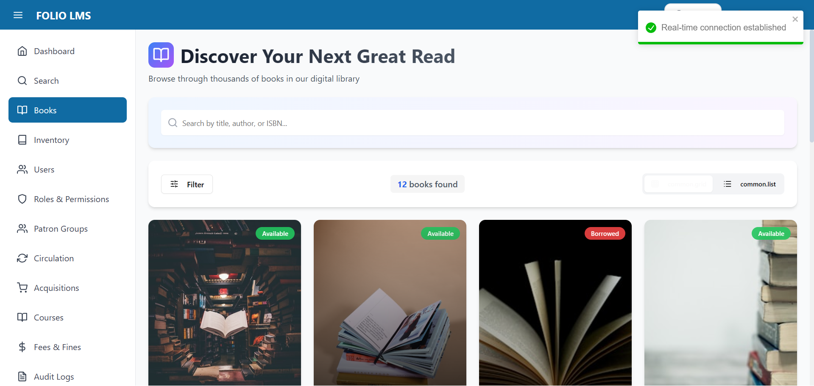

### Description
User-friendly book discovery interface with visual catalog cards.

### Display Information
- **Total Books**: 12 books found
- **View Options**: Grid view (active) and List view
- **Filter Button**: Advanced search and filtering

### Book Cards
Each card displays:
- **Book cover image** (placeholder or actual cover)
- **Availability status** (Available/Checked out badge)
- **Favorite button** (heart icon)
- **Title**: Book name
- **Author**: With icon
- **Category and Year**: Technology, publication year
- **Location**: Call number and location code
- **Availability ratio**: Available copies / Total copies

### Sample Books Displayed
1. **The Art of Computer Programming**
   - Author: Donald Knuth
   - Category: Technology (2020)
   - Location: A-101
   - Available: 3/5

2. **Clean Code**
   - Author: Robert Martin
   - Category: Technology (2019)
   - Location: A-102
   - Available: 2/3

3. **Design Patterns**
   - Author: Gang of Four
   - Category: Technology (2018)
   - Location: A-103
   - Available: 0/2 (Checked out)

4. **البرمجة بلغة Python** (Arabic)
   - Author: محمد أحمد
   - Category: تكنولوجيا (2021)
   - Location: B-201
   - Available: 4/4

### Features
- **Search Bar**: Search by title, author, or ISBN
- **View Details Button**: Access full book information
- **Responsive Grid**: Automatically adjusts to screen size
- **Status Badges**: Clear visual indicators for availability

---

## 9. Circulation

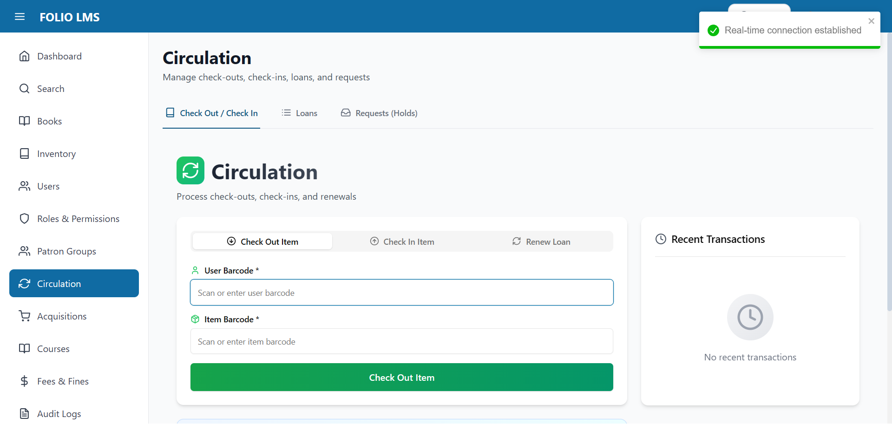

### Description
Central hub for all circulation operations including check-out, check-in, and renewals.

### Navigation Tabs
1. **Check Out / Check In** (Active)
2. **Loans**: View all active and historical loans
3. **Requests (Holds)**: Manage patron requests

### Check Out Panel
Active tab showing check-out form with:
- **Patron Barcode** field (required)
  - Placeholder: "Scan or enter patron barcode"
- **Item Barcode** field (required)
  - Placeholder: "Scan or enter item barcode"
- **Check Out Item** button (green)

### Additional Tabs
- **Return Item**: Process returns
- **Renew Loan**: Extend due dates

### Instructions Panel
Helpful guidance displayed:
- Use barcode scanner or type manually
- Check-out: Scan patron barcode first, then item barcode
- Return: Scan item barcode only
- Renewal: Scan item barcode to extend due date
- Recent transactions appear in right panel

### Recent Transactions Panel
Currently empty showing:
- Clock icon
- "No recent transactions" message

### Features
- **Barcode Scanner Integration**: Quick scanning workflow
- **Manual Entry**: Keyboard input support
- **Real-time Validation**: Immediate feedback on scans
- **Transaction History**: Track all circulation activities
- **Error Handling**: Clear messages for invalid barcodes

---

# Arabic Documentation / الدليل باللغة العربية

## 1. صفحة تسجيل الدخول

### الوصف
توفر صفحة تسجيل الدخول مصادقة آمنة لموظفي المكتبة والمستفيدين. تتميز بتصميم نظيف وحديث مع خلفية متدرجة باللون الأزرق والأرجواني.

### الميزات
- مصادقة اسم المستخدم وكلمة المرور
- عرض بيانات الاعتماد الافتراضية للاختبار
- مبدل اللغة في الزاوية العلوية اليمنى (EN/AR)
- تصميم متجاوب لجميع أحجام الأجهزة
- التحقق من أمان كلمة المرور

### بيانات الاعتماد الافتراضية
- **مسؤول**: admin / Admin@123
- **مستعير**: patron / Patron@123

### التفاصيل التقنية
- مصادقة قائمة على JWT مع رموز الوصول والتحديث
- سياسة كلمة المرور: 8 أحرف كحد أدنى مع حروف كبيرة وصغيرة ورقم وحرف خاص
- إدارة الجلسة مع تحديث تلقائي للرمز
- الحماية من هجمات القوة الغاشمة

---

## 2. لوحة التحكم

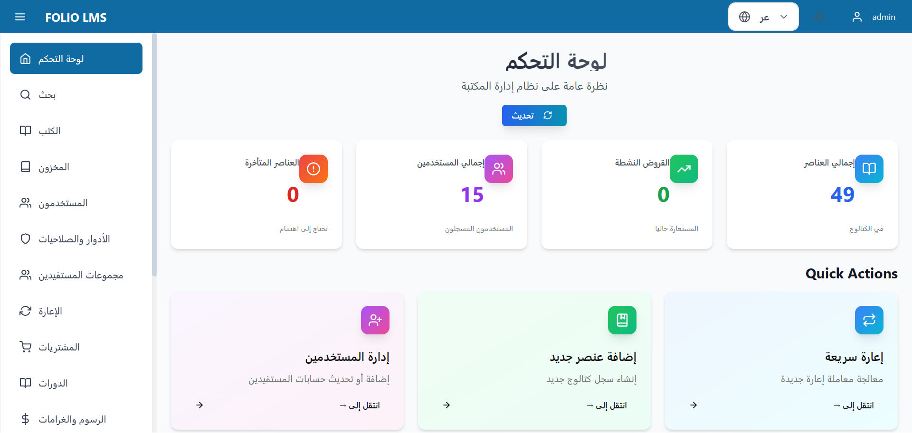

### الوصف
توفر لوحة التحكم الرئيسية نظرة عامة سريعة على عمليات المكتبة مع إحصائيات رئيسية وبطاقات إجراءات سريعة.

### المقاييس الرئيسية المعروضة
- **إجمالي العناصر**: 49 عنصر في الكتالوج
- **القروض النشطة**: 0 مستعارة حالياً
- **إجمالي المستخدمين**: 15 مستخدم مسجل
- **العناصر المتأخرة**: 0 تحتاج إلى اهتمام

### الإجراءات السريعة
1. **إعارة سريعة**: معالجة معاملة إعارة جديدة
2. **إضافة عنصر جديد**: إنشاء سجل كتالوج جديد
3. **إدارة المستخدمين**: إضافة أو تحديث حسابات المستفيدين

### معلومات إضافية
- **القروض الأخيرة**: تعرض أحدث نشاط الإعارة
- **حالة النظام**: تعرض حالة API وقاعدة البيانات وخدمة التخزين المؤقت
- **زر التحديث**: تحديث جميع الإحصائيات في الوقت الفعلي

### التنقل
يوفر الشريط الجانبي الأيمن الوصول إلى جميع الوحدات الرئيسية:
- لوحة التحكم، البحث، الكتب، المخزون
- المستخدمون، الأدوار، مجموعات المستفيدين
- الإعارة، المشتريات، الدورات
- الرسوم والغرامات، سجلات التدقيق

---

## 3. إدارة المستخدمين

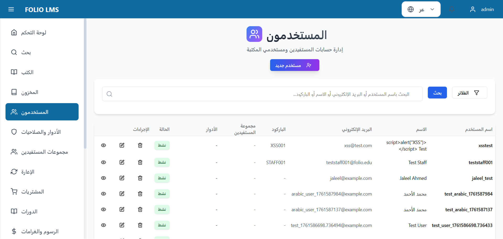

### الوصف
واجهة شاملة لإدارة المستخدمين لإدارة موظفي المكتبة وحسابات المستفيدين.

### الميزات
- **قائمة المستخدمين**: جدول مقسم إلى صفحات يعرض جميع المستخدمين مع المعلومات الرئيسية
- **وظيفة البحث**: البحث بواسطة اسم المستخدم أو البريد الإلكتروني أو الاسم أو الباركود
- **الفلاتر**: التصفية حسب نوع المستخدم والحالة ومجموعة المستفيدين
- **زر مستخدم جديد**: إنشاء حسابات مستخدمين جديدة مع تعيين الأدوار

### أعمدة جدول المستخدمين
- اسم المستخدم
- الاسم الكامل
- البريد الإلكتروني
- الباركود
- مجموعة المستفيدين
- الأدوار المعينة
- الحالة (نشط/غير نشط)
- الإجراءات (عرض، تعديل، حذف)

### أنواع المستخدمين
- **الموظفون**: موظفو المكتبة مع وصول إداري
- **المستعير**: أعضاء المكتبة العاديون مع صلاحيات محدودة

### المستخدمون المعروضون (عينة)
- 15 مستخدم إجمالي بما في ذلك المسؤولون وأمناء المكتبات والفهارسون وموظفو الإعارة والمستفيدون
- مزيج من الأسماء الإنجليزية والعربية يوضح الدعم ثنائي اللغة
- أنواع مستخدمين ومجموعات مستفيدين متنوعة

### الإجراءات المتاحة
- **عرض**: عرض معلومات المستخدم التفصيلية
- **تعديل**: تعديل تفاصيل المستخدم والصلاحيات
- **حذف**: إزالة حساب المستخدم (مع التأكيدات)

---

## 4. الأدوار والصلاحيات

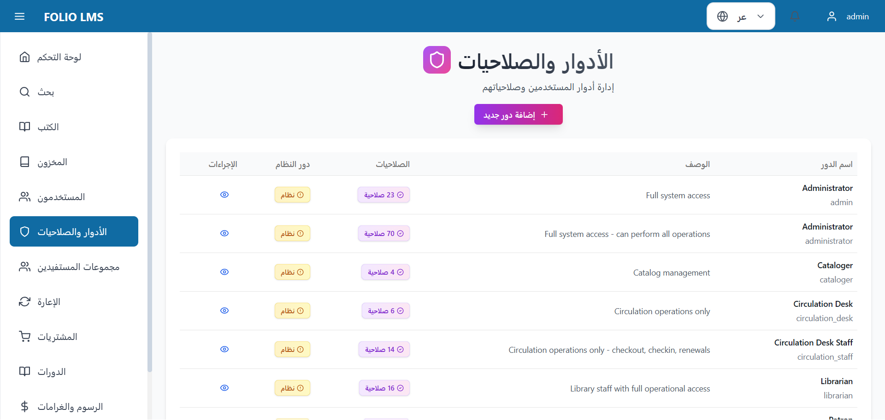

### الوصف
إدارة التحكم في الوصول القائم على الأدوار (RBAC) لتحديد أذونات المستخدم ومستويات الوصول إلى النظام.

### أدوار النظام
1. **Administrator** (23 صلاحية)
   - الوصول الكامل للنظام
   - دور نظام (لا يمكن حذفه)

2. **Administrator** (70 صلاحية)
   - الوصول الكامل للنظام - يمكن تنفيذ جميع العمليات
   - دور نظام

3. **Cataloger** (4 صلاحية)
   - إدارة الفهرس فقط
   - دور نظام

4. **Circulation Desk** (6 صلاحية)
   - عمليات الإعارة فقط
   - دور نظام

5. **Circulation Desk Staff** (14 صلاحية)
   - الإعارة والإرجاع والتجديد
   - دور نظام

6. **Librarian** (16 صلاحية)
   - موظفو المكتبة مع الوصول التشغيلي الكامل
   - دور نظام

7. **Patron** (1 صلاحية)
   - مستعير المكتبة العادي
   - دور نظام

### الميزات
- **عرض الصلاحيات**: رؤية جميع الصلاحيات المعينة لكل دور
- **عدد الصلاحيات**: نظرة عامة سريعة على مستويات الصلاحيات
- **مؤشر دور النظام**: يحدد أدوار النظام المحمية
- **إضافة دور جديد**: إنشاء أدوار مخصصة مع صلاحيات محددة

### إدارة الصلاحيات
- نظام صلاحيات دقيق يتبع نمط `المورد.الإجراء`
- أمثلة: `inventory.create`، `circulation.checkout`، `users.update`
- الصلاحيات مجمعة حسب المورد (المخزون، الإعارة، المستخدمون، إلخ)

---

## 5. مجموعات المستفيدين

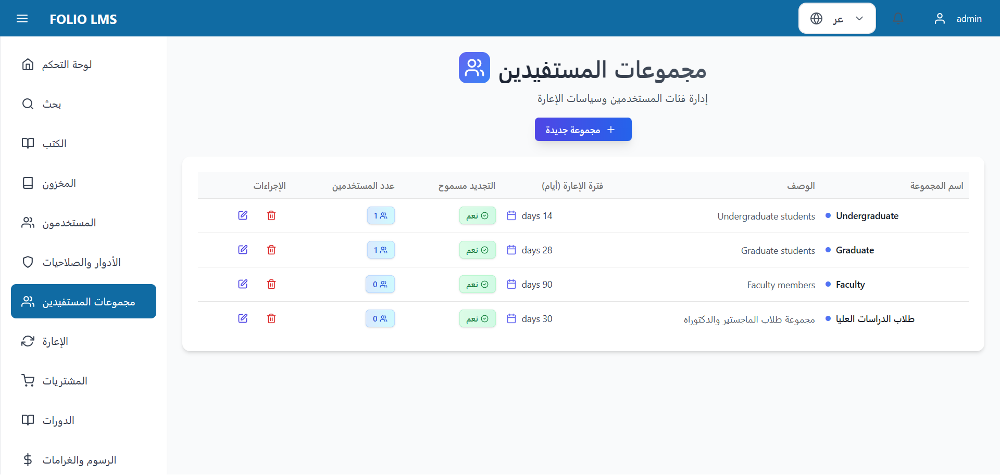

### الوصف
إدارة فئات المستفيدين مع سياسات إعارة وامتيازات مختلفة.

### مجموعات المستفيدين المعروضة
1. **Undergraduate** (1 مستخدم)
   - فترة الإعارة: 14 يوم
   - التجديد مسموح: نعم
   - الوصف: طلاب المرحلة الجامعية

2. **Graduate** (1 مستخدم)
   - فترة الإعارة: 28 يوم
   - التجديد مسموح: نعم
   - الوصف: طلاب الدراسات العليا

3. **Faculty** (0 مستخدم)
   - فترة الإعارة: 90 يوم
   - التجديد مسموح: نعم
   - الوصف: أعضاء هيئة التدريس

4. **طلاب الدراسات العليا** (0 مستخدم)
   - فترة الإعارة: 30 يوم
   - التجديد مسموح: نعم
   - الوصف: مجموعة طلاب الماجستير والدكتوراه

### الميزات
- **زر مجموعة جديدة**: إنشاء مجموعات مستفيدين جديدة
- **تعديل**: تعديل إعدادات المجموعة وسياسات الإعارة
- **حذف**: إزالة المجموعات (فقط إذا لم يكن هناك مستخدمون معينون)
- **عدد المستخدمين**: يعرض عدد المستفيدين في كل مجموعة

### إعدادات سياسة الإعارة
- فترة إعارة قابلة للتكوين بالأيام
- أذونات التجديد (السماح/عدم السماح)
- وصف للمرجع الداخلي

---

## 6. الرسوم والغرامات

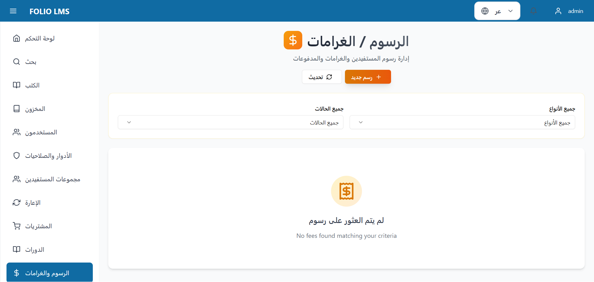

### الوصف
نظام شامل لإدارة الرسوم والغرامات لتتبع رسوم المستفيدين والمدفوعات.

### الميزات
- **فلتر الحالة**: التصفية حسب حالة الرسوم (الكل، مفتوح، مدفوع، معفى)
- **فلتر النوع**: التصفية حسب نوع الرسوم (متأخر، مفقود، تالف، إلخ)
- **زر رسم جديد**: إنشاء رسوم يدوياً للمستفيدين
- **تحديث**: تحديث قائمة الرسوم بأحدث البيانات

### الحالة الفارغة
يعرض حالياً عدم وجود رسوم في النظام. تعرض الصفحة:
- أيقونة تشير إلى الحالة الفارغة
- رسالة: "لم يتم العثور على رسوم"
- عنوان فرعي: "No fees found matching your criteria"

### قدرات إدارة الرسوم
- إنشاء رسوم يدوية
- تتبع غرامات التأخير (حساب تلقائي)
- تسجيل المدفوعات
- إعفاء الرسوم مع السبب
- عرض سجل الدفع
- إنشاء تقارير الرسوم

### حالات الرسوم
- **مفتوح**: رسوم غير مدفوعة تتطلب إجراء
- **مدفوع**: رسوم تم دفعها
- **معفى**: رسوم معفاة من قبل الموظفين
- **محول**: رسوم محولة إلى وكالة التحصيل

---

## 7. إدارة المخزون

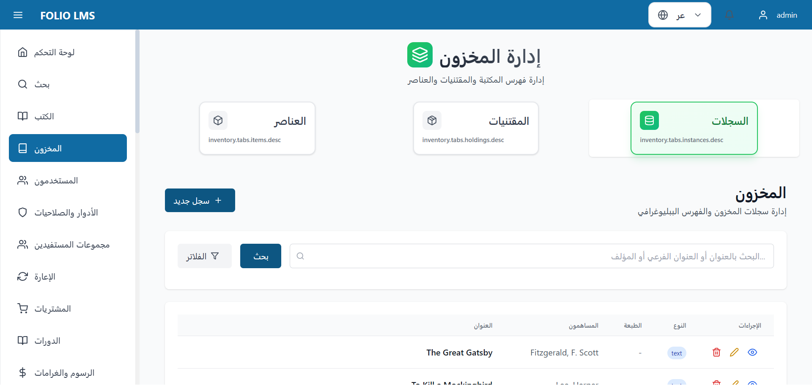

### الوصف
نظام إدارة مخزون من ثلاثة مستويات لتنظيم مواد المكتبة.

### مستويات التسلسل الهرمي
1. **السجلات** (محدد)
   - سجلات ببليوغرافية
   - العنوان، المؤلف، معلومات النشر
   - يعرض حالياً 49 سجل إجمالي

2. **المقتنيات**
   - معلومات الموقع ورقم الاستدعاء
   - ربط السجلات بالمواقع الفعلية

3. **العناصر**
   - نسخ فردية مادية أو إلكترونية
   - الباركود والحالة ومعلومات الإعارة

### العرض الحالي - جدول السجلات
يعرض الجدول:
- **العنوان**: عنوان الكتاب/المورد
- **المساهمون**: المؤلفون والمبدعون
- **الطبعة**: طبعة النشر
- **النوع**: نوع المورد (نص، فيديو، إلخ)
- **الإجراءات**: أزرار عرض، تعديل، حذف

### سجلات عينة (مرئية)
- The Great Gatsby (Fitzgerald, F. Scott)
- To Kill a Mockingbird (Lee, Harper)
- كتب أدب عربي (تظهر الدعم ثنائي اللغة)
- كتب تكنولوجيا (مؤلفون مختلفون)

### الميزات
- **زر سجل جديد**: إنشاء سجلات ببليوغرافية جديدة
- **بحث**: البحث عن السجلات بالعنوان أو العنوان الفرعي أو المؤلف
- **فلاتر**: خيارات تصفية متقدمة
- **الترقيم**: التصفح عبر صفحات متعددة (صفحة 1 من 3)

---

## 8. فهرس الكتب

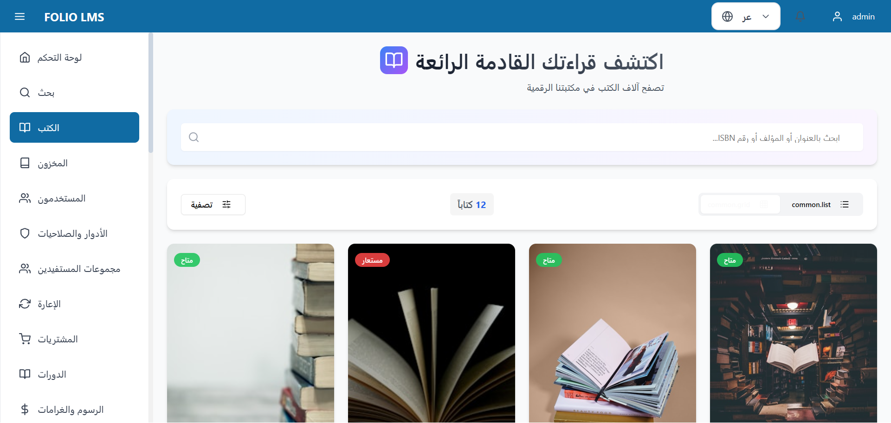

### الوصف
واجهة اكتشاف كتب سهلة الاستخدام مع بطاقات كتالوج مرئية.

### معلومات العرض
- **إجمالي الكتب**: 12 كتاب
- **خيارات العرض**: عرض الشبكة (نشط) وعرض القائمة
- **زر التصفية**: بحث وتصفية متقدمة

### بطاقات الكتب
تعرض كل بطاقة:
- **صورة غلاف الكتاب** (نائب أو غلاف فعلي)
- **حالة التوفر** (شارة متاح/مستعار)
- **زر المفضلة** (أيقونة قلب)
- **العنوان**: اسم الكتاب
- **المؤلف**: مع أيقونة
- **الفئة والسنة**: التكنولوجيا، سنة النشر
- **الموقع**: رقم الاستدعاء ورمز الموقع
- **نسبة التوفر**: النسخ المتاحة / إجمالي النسخ

### كتب عينة معروضة
1. **The Art of Computer Programming**
   - المؤلف: Donald Knuth
   - الفئة: Technology (2020)
   - الموقع: A-101
   - متاح: 3/5

2. **Clean Code**
   - المؤلف: Robert Martin
   - الفئة: Technology (2019)
   - الموقع: A-102
   - متاح: 2/3

3. **Design Patterns**
   - المؤلف: Gang of Four
   - الفئة: Technology (2018)
   - الموقع: A-103
   - متاح: 0/2 (مستعار)

4. **البرمجة بلغة Python**
   - المؤلف: محمد أحمد
   - الفئة: تكنولوجيا (2021)
   - الموقع: B-201
   - متاح: 4/4

### الميزات
- **شريط البحث**: البحث بالعنوان أو المؤلف أو رقم ISBN
- **زر عرض التفاصيل**: الوصول إلى معلومات الكتاب الكاملة
- **شبكة متجاوبة**: تضبط تلقائياً على حجم الشاشة
- **شارات الحالة**: مؤشرات مرئية واضحة للتوفر

---

## 9. الإعارة

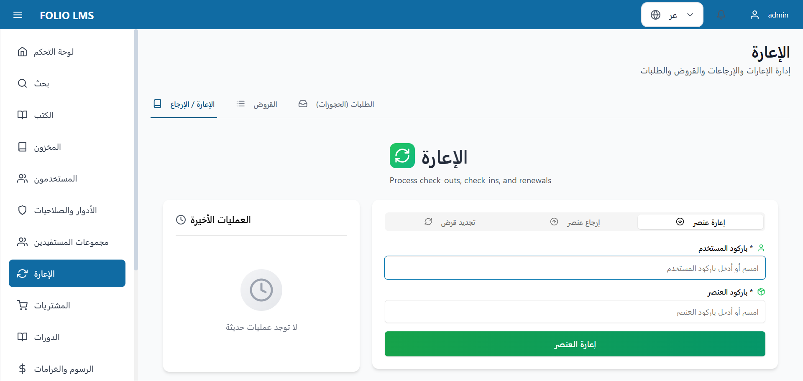

### الوصف
مركز مركزي لجميع عمليات الإعارة بما في ذلك الإعارة والإرجاع والتجديد.

### علامات التبويب للتنقل
1. **الإعارة / الإرجاع** (نشط)
2. **القروض**: عرض جميع القروض النشطة والتاريخية
3. **الطلبات (الحجوزات)**: إدارة طلبات المستفيدين

### لوحة الإعارة
علامة التبويب النشطة تعرض نموذج الإعارة مع:
- **باركود المستخدم** حقل (مطلوب)
  - النائب: "امسح أو أدخل باركود المستخدم"
- **باركود العنصر** حقل (مطلوب)
  - النائب: "امسح أو أدخل باركود العنصر"
- **زر إعارة العنصر** (أخضر)

### علامات تبويب إضافية
- **إرجاع عنصر**: معالجة الإرجاعات
- **تجديد قرض**: تمديد تواريخ الاستحقاق

### لوحة التعليمات
إرشادات مفيدة معروضة:
- استخدم ماسح الباركود أو اكتب يدوياً
- الإعارة: امسح باركود المستخدم أولاً، ثم باركود العنصر
- الإرجاع: امسح باركود العنصر فقط
- التجديد: امسح باركود العنصر لتمديد تاريخ الاستحقاق
- تظهر العمليات الأخيرة في اللوحة على اليمين

### لوحة العمليات الأخيرة
حالياً فارغة تعرض:
- أيقونة ساعة
- رسالة "لا توجد عمليات حديثة"

### الميزات
- **تكامل ماسح الباركود**: سير عمل مسح سريع
- **الإدخال اليدوي**: دعم إدخال لوحة المفاتيح
- **التحقق في الوقت الفعلي**: ملاحظات فورية على عمليات المسح
- **سجل العمليات**: تتبع جميع أنشطة الإعارة
- **معالجة الأخطاء**: رسائل واضحة للباركودات غير الصالحة

---

## Technical Implementation / التنفيذ التقني

### Frontend Stack / مجموعة الواجهة الأمامية
- **React 18.2** with TypeScript 5.3
- **Vite 5.0** for build tooling
- **Redux Toolkit 2.0** for state management
- **Tailwind CSS 3.4** for styling with RTL support
- **React Router 6.21** for navigation
- **Framer Motion** for animations
- **shadcn/ui** components library

### Backend Stack / مجموعة الواجهة الخلفية
- **FastAPI** (Python 3.11+) web framework
- **SQLAlchemy 2.0** ORM with async support
- **PostgreSQL 15** database
- **Redis** for caching and queuing
- **Celery** for background tasks
- **JWT** for authentication

### Bilingual Implementation / تطبيق ثنائي اللغة
- **LanguageContext**: React context for language management
- **Translation Files**: Separate JSON files for EN/AR
- **RTL Support**: Automatic layout flip for Arabic
- **Logical Properties**: CSS using `start`/`end` instead of `left`/`right`

### Key Features / الميزات الرئيسية
- **Multi-tenancy**: Support for multiple library branches
- **RBAC**: Role-based access control with 70+ permissions
- **Real-time Updates**: WebSocket notifications
- **Responsive Design**: Mobile-friendly interface
- **Accessibility**: WCAG 2.1 AA compliant

---

## Conclusion / الخلاصة

This bilingual documentation provides comprehensive coverage of the FOLIO LMS system's main features and functionalities in both English and Arabic. The system demonstrates professional bilingual support with proper RTL layout, comprehensive Arabic translations, and seamless language switching.

يوفر هذا الدليل ثنائي اللغة تغطية شاملة للميزات والوظائف الرئيسية لنظام FOLIO LMS باللغتين الإنجليزية والعربية. يوضح النظام دعماً ثنائي اللغة احترافياً مع تخطيط RTL الصحيح، وترجمات عربية شاملة، والتبديل السلس بين اللغات.

---

**Generated with Claude Code**
**تم إنشاؤه بواسطة كلود كود**

Date / التاريخ: November 2, 2025
Version / الإصدار: 1.0.0
