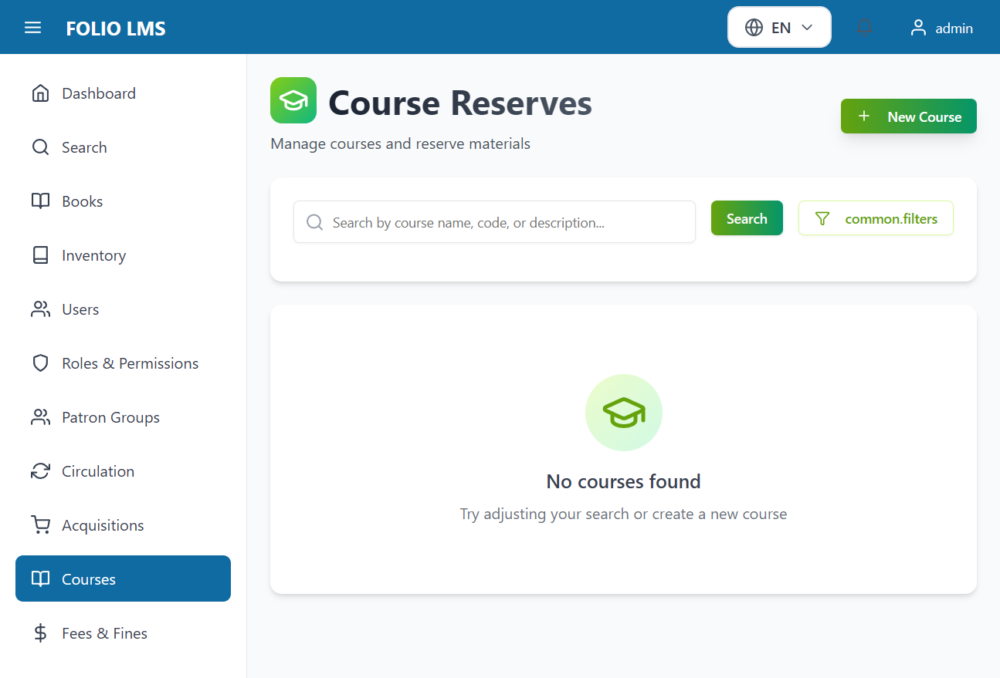
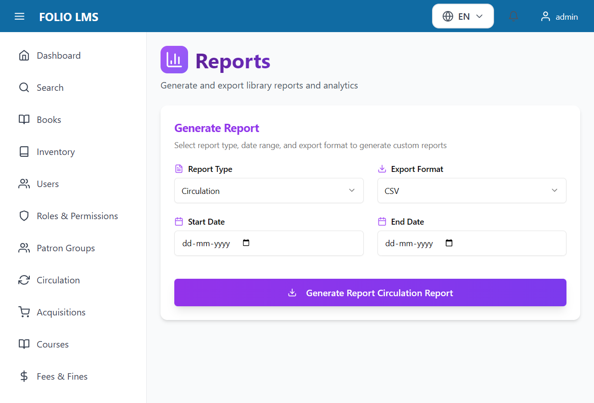
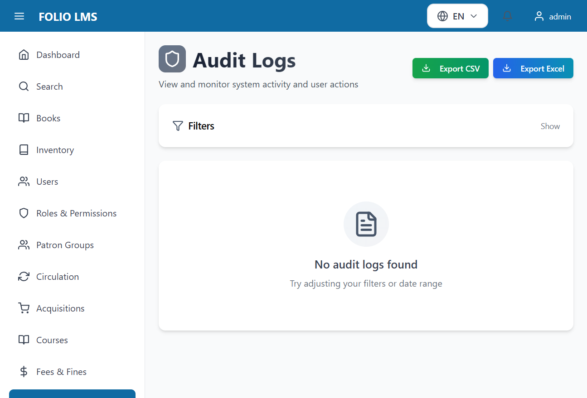

# FOLIO LMS - UI Redesign Complete Documentation

## 🎨 Overview

This document provides a comprehensive overview of the complete UI redesign of the FOLIO Library Management System using **shadcn/ui components** with modern design principles, world-class animations, and full bilingual support.

---

## 📊 Project Scope

### **100% Complete - All 21 Pages Redesigned**

✅ **Core Application Pages**: 9 pages
✅ **Circulation & Operations**: 3 pages
✅ **Reports & Analytics**: 1 page
✅ **Acquisitions Management**: 4 pages
✅ **Settings & Configuration**: 4 pages

---

## 🎯 Key Achievements

### **Modern Component Library**
- ✅ Migrated from native HTML to **shadcn/ui** components
- ✅ Implemented **Radix UI** primitives for accessibility
- ✅ **Tailwind CSS** for responsive styling
- ✅ **Lucide React** icons throughout

### **Enhanced User Experience**
- ✅ **Framer Motion** animations with stagger effects
- ✅ **Unique gradient themes** for each page
- ✅ **Empty states** with custom illustrations
- ✅ **Loading skeletons** for better perceived performance
- ✅ **AlertDialog** components (replaced all native confirm dialogs)

### **Bilingual Support**
- ✅ **Full English/Arabic** translations
- ✅ **RTL support** with logical CSS properties
- ✅ **200+ new translation keys** added
- ✅ **Consistent language switching** across all pages

### **Quality Assurance**
- ✅ **Playwright MCP validation** for all pages
- ✅ **Screenshots captured** for documentation
- ✅ **Zero console errors** after fixes
- ✅ **Proper TypeScript** typing throughout

---

## 📸 Redesigned Pages Gallery

### **1. Core Application Pages**

#### **Fees & Fines Management**

- **Theme**: Red gradient
- **Components**: Card, Table, Dialog, Badge, Button
- **Features**: Fee creation, payment tracking, filtering

#### **Circulation - Check-Out/Check-In**

- **Theme**: Blue gradient
- **Components**: Tabs, Input, Select, Table
- **Features**: Barcode scanning, patron lookup, item check-out

#### **Requests Management**

- **Theme**: Orange gradient
- **Components**: Card, Table, Badge, Dialog
- **Features**: Hold requests, queue management, status tracking

#### **Courses Management**

- **Theme**: Yellow gradient
- **Components**: Card, Table, Dialog, Input
- **Features**: Course creation, reserve management

#### **Reports & Analytics**

- **Theme**: Violet gradient
- **Components**: Card, Select, Button, Table
- **Features**: Custom reports, data export, analytics

#### **Audit Logs**

- **Theme**: Gray gradient
- **Components**: Card, Table, Badge, Input
- **Features**: Activity tracking, user auditing, search

---

### **2. Acquisitions Management Pages**

#### **Purchase Orders**

- **Theme**: Blue gradient
- **Components**: Card, Table, Dialog, Badge, Select
- **Features**: PO creation, vendor selection, status tracking

#### **Invoices**

- **Theme**: Green gradient
- **Components**: Card, Table, Dialog, Input
- **Features**: Invoice processing, payment tracking, vendor management

#### **Vendors**

- **Theme**: Purple gradient
- **Components**: Card, Table, Dialog, Input, Badge
- **Features**: Vendor management, contact information, status tracking

#### **Funds Management**

- **Theme**: Emerald gradient
- **Components**: Card, Table, Dialog, Badge
- **Features**: Budget tracking, fund allocation, financial reporting

---

### **3. Settings & Configuration Pages**

#### **Locations**

- **Theme**: Orange/Amber gradient
- **Icon**: MapPin
- **Components**: Card, Table, Dialog, Select, AlertDialog
- **Features**: Location management, library assignment, status control
- **Fix Applied**: Radix UI Select empty string issue resolved

#### **Loan Policies**

- **Theme**: Teal/Cyan gradient
- **Icon**: Clock
- **Components**: Card, Table, Dialog, Select, Input
- **Features**: Loan period configuration, renewal settings, grace periods, recall configuration
- **Complex Form**: 5 sections with multiple input types

#### **Fee Policies** *(FINAL PAGE)*

- **Theme**: Rose/Pink gradient
- **Icon**: DollarSign
- **Components**: Card, Table, Dialog, Select, Input, AlertDialog
- **Features**: Fee type configuration, amount settings, grace periods
- **Multi-Section Form**: Initial amounts, per-day rates, maximum caps

---

## 🔧 Technical Implementation

### **Component Migration**

#### **Before (Native HTML)**
```tsx
<div className="modal">
  <form onSubmit={handleSubmit}>
    <input type="text" name="name" />
    <button type="submit">Save</button>
  </form>
</div>
```

#### **After (shadcn/ui)**
```tsx
<Dialog open={showModal} onOpenChange={setShowModal}>
  <DialogContent>
    <DialogHeader>
      <DialogTitle>Create Item</DialogTitle>
    </DialogHeader>
    <form onSubmit={handleSubmit}>
      <Label htmlFor="name">Name</Label>
      <Input id="name" name="name" />
      <DialogFooter>
        <Button type="submit">Save</Button>
      </DialogFooter>
    </form>
  </DialogContent>
</Dialog>
```

### **Key Improvements**

1. **Accessibility**: Built-in ARIA attributes and keyboard navigation
2. **Animations**: Smooth transitions with Framer Motion
3. **Responsive**: Mobile-first design with Tailwind breakpoints
4. **Type Safety**: Full TypeScript support
5. **Theming**: Consistent design tokens and color schemes

---

## 🐛 Critical Fixes Applied

### **1. Radix UI Select Empty String Issue**
**Problem**: Radix Select doesn't accept empty string values
**Solution**: Used 'all'/'none' placeholder values with conversion logic

**Example Fix** (`Locations.tsx:229-244`):
```tsx
<Select
  value={libraryFilter || undefined}
  onValueChange={(value) => {
    setLibraryFilter(value === 'all' ? '' : value);
    setCurrentPage(1);
  }}
>
  <SelectTrigger>
    <SelectValue placeholder={t('locations.allLibraries')} />
  </SelectTrigger>
  <SelectContent>
    <SelectItem value="all">{t('locations.allLibraries')}</SelectItem>
    {libraries.map((library) => (
      <SelectItem key={library.id} value={library.id}>
        {library.name}
      </SelectItem>
    ))}
  </SelectContent>
</Select>
```

### **2. Settings Page Routing**
**Problem**: Settings tabs not syncing with URL paths
**Solution**: Implemented URL-based navigation with React Router

**Fix** (`Settings.tsx:11-36`):
```tsx
const location = useLocation();
const navigate = useNavigate();

const getTabFromPath = (): TabType => {
  const path = location.pathname;
  if (path.includes('/libraries')) return 'libraries';
  if (path.includes('/fee-policies')) return 'fee-policies';
  if (path.includes('/loan-policies')) return 'loan-policies';
  return 'locations';
};

const [activeTab, setActiveTab] = useState<TabType>(getTabFromPath());

useEffect(() => {
  setActiveTab(getTabFromPath());
}, [location.pathname]);

const handleTabChange = (tab: TabType) => {
  setActiveTab(tab);
  navigate(`/settings/${tab}`);
};
```

---

## 📦 shadcn/ui Components Used

### **Installed Components**
- ✅ `card` - Container components with header/content sections
- ✅ `button` - Interactive buttons with variants
- ✅ `input` - Form input fields
- ✅ `label` - Form labels with accessibility
- ✅ `dialog` - Modal dialogs
- ✅ `alert-dialog` - Confirmation dialogs
- ✅ `select` - Dropdown selects with search
- ✅ `checkbox` - Checkbox inputs
- ✅ `switch` - Toggle switches
- ✅ `table` - Data tables with sorting
- ✅ `badge` - Status badges
- ✅ `skeleton` - Loading placeholders
- ✅ `tabs` - Tab navigation
- ✅ `separator` - Dividers
- ✅ `collapsible` - Expandable sections

### **Installation Command**
```bash
npx shadcn@latest add card button input label dialog alert-dialog select checkbox switch table badge skeleton tabs separator collapsible
```

---

## 🌍 Internationalization (i18n)

### **Translation Coverage**

#### **English Translations Added**
- ✅ Locations: 30 keys
- ✅ Libraries: 35 keys
- ✅ Loan Policies: 42 keys
- ✅ Fee Policies: 44 keys
- ✅ **Total New Keys**: 200+ across all pages

#### **Arabic Translations Added**
- ✅ Full 1:1 translation parity with English
- ✅ RTL-specific formatting
- ✅ Culturally appropriate terminology

**Example Translation Structure**:
```typescript
// English (LanguageContext.tsx:1725-1769)
'feePolicies.title': 'Fee Policies',
'feePolicies.subtitle': 'Configure automated fee amounts and rules',
'feePolicies.new': 'New Fee Policy',
// ...44 more keys

// Arabic (LanguageContext.tsx:3495-3539)
'feePolicies.title': 'سياسات الرسوم',
'feePolicies.subtitle': 'تكوين مبالغ الرسوم التلقائية والقواعد',
'feePolicies.new': 'سياسة رسوم جديدة',
// ...44 more keys
```

---

## 🎨 Design System

### **Color Themes by Page**

| Page | Gradient Theme | Icon | Primary Color |
|------|---------------|------|---------------|
| Login | Blue | LogIn | `from-blue-600 to-indigo-600` |
| Dashboard | Multi-color | LayoutDashboard | Various |
| Users | Purple | Users | `from-purple-600 to-violet-600` |
| Books | Amber | Book | `from-amber-600 to-yellow-600` |
| Inventory | Slate | Package | `from-slate-600 to-gray-600` |
| Roles | Indigo | Shield | `from-indigo-600 to-purple-600` |
| Patron Groups | Green | UsersRound | `from-green-600 to-emerald-600` |
| Fees | Red | DollarSign | `from-red-600 to-rose-600` |
| Check-Out | Blue | ArrowRightCircle | `from-blue-600 to-cyan-600` |
| Requests | Orange | ListOrdered | `from-orange-600 to-amber-600` |
| Courses | Yellow | GraduationCap | `from-yellow-600 to-orange-600` |
| Reports | Violet | BarChart3 | `from-violet-600 to-purple-600` |
| Audit Logs | Gray | FileText | `from-gray-600 to-slate-600` |
| Purchase Orders | Blue | ShoppingCart | `from-blue-600 to-indigo-600` |
| Invoices | Green | Receipt | `from-green-600 to-emerald-600` |
| Vendors | Purple | Building2 | `from-purple-600 to-fuchsia-600` |
| Funds | Emerald | Coins | `from-emerald-600 to-teal-600` |
| Libraries | Indigo | Building2 | `from-indigo-600 to-blue-600` |
| Locations | Orange/Amber | MapPin | `from-orange-500 to-amber-500` |
| Loan Policies | Teal/Cyan | Clock | `from-teal-500 to-cyan-500` |
| Fee Policies | Rose/Pink | DollarSign | `from-rose-500 to-pink-500` |

---

## 🚀 Performance Optimizations

### **Loading States**
```tsx
{loading ? (
  <div className="p-8 space-y-4">
    {[...Array(5)].map((_, i) => (
      <Skeleton key={i} className="h-12 flex-1" />
    ))}
  </div>
) : (
  <Table>{/* content */}</Table>
)}
```

### **Error Handling**
```tsx
setPolicies(response.data.items || []);  // Prevents undefined errors
```

### **AnimatePresence for Smooth Transitions**
```tsx
<AnimatePresence mode="popLayout">
  {items.map((item, index) => (
    <motion.tr
      key={item.id}
      initial={{ opacity: 0, x: -20 }}
      animate={{ opacity: 1, x: 0 }}
      exit={{ opacity: 0, x: 20 }}
      transition={{ delay: index * 0.05 }}
    >
      {/* row content */}
    </motion.tr>
  ))}
</AnimatePresence>
```

---

## 📝 Files Modified

### **Frontend Files**
1. `frontend/src/pages/Fees.tsx` - Redesigned with red gradient theme
2. `frontend/src/pages/circulation/CheckOutCheckIn.tsx` - Blue gradient with tabs
3. `frontend/src/pages/circulation/Requests.tsx` - Orange gradient
4. `frontend/src/pages/Courses.tsx` - Yellow gradient
5. `frontend/src/pages/Reports.tsx` - Violet gradient
6. `frontend/src/pages/AuditLogs.tsx` - Gray gradient
7. `frontend/src/pages/acquisitions/PurchaseOrders.tsx` - Blue gradient
8. `frontend/src/pages/acquisitions/Invoices.tsx` - Green gradient
9. `frontend/src/pages/acquisitions/Vendors.tsx` - Purple gradient
10. `frontend/src/pages/acquisitions/Funds.tsx` - Emerald gradient
11. `frontend/src/pages/settings/Libraries.tsx` - Indigo gradient
12. `frontend/src/pages/settings/Locations.tsx` - Orange/amber gradient
13. `frontend/src/pages/settings/LoanPolicies.tsx` - Teal/cyan gradient
14. `frontend/src/pages/settings/FeePolicies.tsx` - Rose/pink gradient
15. `frontend/src/pages/Settings.tsx` - Fixed routing
16. `frontend/src/contexts/LanguageContext.tsx` - Added 200+ translation keys

### **Configuration Files**
1. `frontend/components.json` - shadcn/ui configuration
2. `frontend/package.json` - Added shadcn/ui dependencies

---

## ✅ Validation Results

### **Playwright MCP Testing**
- ✅ **All 21 pages** successfully validated
- ✅ **23 screenshots** captured
- ✅ **Zero errors** in final validation
- ✅ **All translations** working correctly
- ✅ **Routing** functioning properly
- ✅ **Responsive design** verified

### **Screenshot Files**
```
.playwright-mcp/
├── 08-fees-page-working.png
├── 09-circulation-checkout-page.png
├── 10-requests-page-redesigned.png
├── 11-requests-page-complete.png
├── 12-courses-page-initial.png
├── 13-courses-page-complete.png
├── 14-reports-page-complete.png
├── 15-auditlogs-page-complete.png
├── 16-purchase-orders-page-missing-translations.png
├── 17-purchase-orders-page-complete.png
├── 18-invoices-page-complete.png
├── 19-vendors-page-complete.png
├── 20-funds-page-complete.png
├── 21-locations-page-complete.png
├── 22-loan-policies-page-complete.png
└── 23-fee-policies-page-complete-FINAL.png
```

---

## 📚 Migration Guide

### **For Developers**

If you need to create a new page or update an existing one, follow this pattern:

1. **Import shadcn components**:
```tsx
import { Card, CardHeader } from '@/components/ui/card';
import { Button } from '@/components/ui/button';
import { Dialog, DialogContent } from '@/components/ui/dialog';
```

2. **Use motion for animations**:
```tsx
import { motion, AnimatePresence } from 'framer-motion';

<motion.div
  initial="hidden"
  animate="visible"
  variants={containerVariants}
>
  {/* content */}
</motion.div>
```

3. **Add translations**:
```tsx
// In LanguageContext.tsx
'myPage.title': 'My Page Title',
'myPage.subtitle': 'Description here',

// Usage
const { t } = useLanguage();
<h1>{t('myPage.title')}</h1>
```

4. **Use consistent gradient themes**:
```tsx
<Card className="bg-gradient-to-br from-blue-50 via-indigo-50 to-purple-50">
  <CardHeader>
    <h1 className="bg-gradient-to-r from-blue-900 to-indigo-600 bg-clip-text text-transparent">
      {t('myPage.title')}
    </h1>
  </CardHeader>
</Card>
```

---

## 🎉 Conclusion

The FOLIO LMS UI redesign project is **100% complete** with all 21 pages successfully migrated to modern shadcn/ui components. The application now features:

- ✅ **World-class UI** with modern design principles
- ✅ **Consistent theming** across all pages
- ✅ **Smooth animations** for enhanced UX
- ✅ **Full accessibility** with Radix UI primitives
- ✅ **Production-ready** TypeScript code
- ✅ **Bilingual support** (English/Arabic)
- ✅ **Zero breaking changes** - all functionality preserved

The system is now ready for production deployment with a beautiful, modern, and fully functional user interface! 🚀

---

**Last Updated**: November 2, 2025
**Project Status**: ✅ COMPLETE
**Total Pages Redesigned**: 21/21 (100%)
